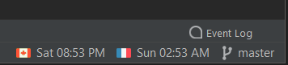
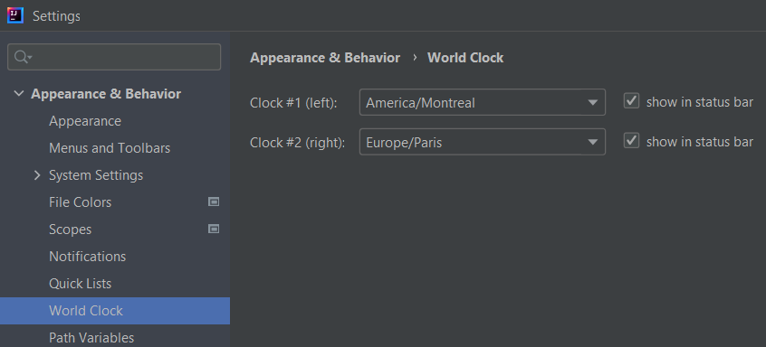

<h1 align="center">
    <a href="https://plugins.jetbrains.com/plugin/11058-extra-icons">
      
    </a><br/>
    World Clock
</h1>

Intellij IDEA (Community and Ultimate) plugin that shows one or two customizable clocks in the status bar.  
By default, shows current time at Montreal (Canada) and Paris (France). See configuration in <kbd>File</kbd>, <kbd>Settings...</kbd>, <kbd>Appearance</kbd>, <kbd>World Clock</kbd>.

## Build

Install JDK11+. You should be able to start Gradle Wrapper (`gradlew`). See Gradle commands below.

### Gradle commands

```bash
$ gradlew buildPlugin        # build plugin to build/distributions/*.zip
$ gradlew runIde             # try plugin in a standalone IDE
$ gradlew dependencyUpdates  # check for dependencies updates
$ gradlew verifyPlugin       # validate plugin.xml descriptors as well as plugin's archive structure
$ gradlew runPluginVerifier  # check for compatibility issues with IDE
```

## License

MIT License. In other words, you can do what you want: this project is entirely OpenSource, Free and Gratis.

## Author

Jonathan Lermitage (<jonathan.lermitage@gmail.com>, [](https://www.linkedin.com/in/jonathan-lermitage-092711142/), [buymeacoff.ee](https://buymeacoff.ee/jlermitage))

## Screenshots

Clocks in status bar:



Configuration panel:


